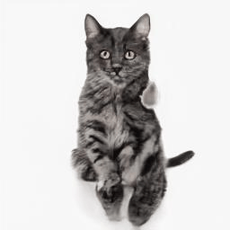
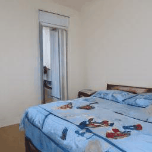
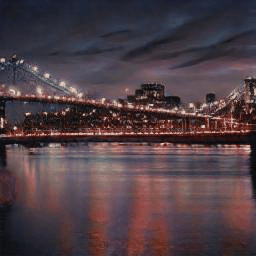
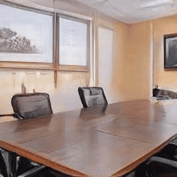
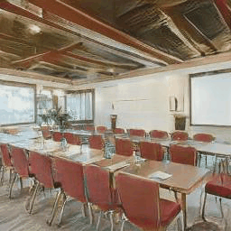
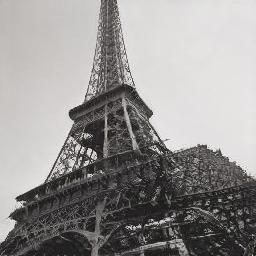

# Discover the Unknown Biased Attribute of an Image Classifier


## Paper

**Discover the Unknown Biased Attribute of an Image Classifier**

[Zhiheng Li](https://zhiheng.li/), [Chenliang Xu](https://www.cs.rochester.edu/~cxu22/)

University of Rochester


**Preprint**: https://arxiv.org/abs/2104.14556

**Contact**: Zhiheng Li (zhiheng.li@rochester.edu)


## Abstract

Recent works find that AI algorithms learn biases from data. Therefore, it is urgent and vital to identify biases in AI algorithms. However, the previous bias identification pipeline overly relies on human experts to conjecture potential biases (e.g., gender), which may neglect other underlying biases not realized by humans. To help human experts better find the AI algorithms' biases, we study a new problem in this work -- for a classifier that predicts a target attribute of the input image, discover its unknown biased attribute.


To solve this challenging problem, we use a hyperplane in the generative model's latent space to represent an image attribute; thus, the original problem is transformed to optimizing the hyperplane's normal vector and offset. We propose a novel total-variation loss within this framework as the objective function and a new orthogonalization penalty as a constraint. The latter prevents trivial solutions in which the discovered biased attribute is identical with the target or one of the known-biased attributes. Extensive experiments on both disentanglement datasets and real-world datasets show that our method can discover biased attributes and achieve better disentanglement w.r.t. target attributes. Furthermore, the qualitative results show that our method can discover unnoticeable biased attributes for various object and scene classifiers, proving our method's generalizability for detecting biased attributes in diverse domains of images. 


## Discovered Unknown Biased Attributes

Here we show some interesting unknown biased attributes discovered by our method.


The classifier (first column)'s target prediction's probability (second column) gradually **decreases** as the image transforms (last two columns) under the discovered unknown biased attribute (third column).


For example, the ResNet-18 classifier trained on ImageNet's predicted probability of the "Cat" class gradually decreases as the cat's shade of fur color goes darker.


|             Classifier             | Classfier's Target Prediction |             Discovered Unknown Biased Attribute              |                                                              |                                                              |
| :--------------------------------: | :---------------------------: | :----------------------------------------------------------: | :----------------------------------------------------------: | :----------------------------------------------------------: |
| ResNet-18 Trained on ImageNet [1]  |              Cat              |        shade of fur color (light $\rightarrow$ dark)         |  |  |
| ResNet-18 Trained on Places365 [2] |            Bedroom            |              number of beds (1 $\rightarrow$ 2)              |  |  |
| ResNet-18 Trained on Places365 [2] |            Bridge             | buildings in the background (no building $\rightarrow$ building) |  |  |
| ResNet-18 Trained on Places365 [2] |        Conference Room        | layout of conference room (table \$\rightarrow$ hollow square table / no table) |  |  |
| ResNet-18 Trained on Places365 [2] |             Tower             |  is Eiffel Tower (Eiffel tower $\rightarrow$ other towers)   |  |                                |

### References

[1] J. Deng, W. Dong, R. Socher, L.-J. Li, Kai Li, and Li Fei-Fei, “ImageNet: A large-scale hierarchical image database,” in *The IEEE Conference on Computer Vision and Pattern Recognition (CVPR)*, Jun. 2009, pp. 248–255.

[2] B. Zhou, A. Lapedriza, A. Khosla, A. Oliva, and A. Torralba, “Places: A 10 million image database for scene recognition,” *IEEE Transactions on Pattern Analysis and Machine Intelligence*, vol. 40, no. 6, pp. 1452–1464, 2018.


## Citation

```
@article{li-2021-discover,
  title = {Discover the {{Unknown Biased Attribute}} of an {{Image Classifier}}},
  author = {Li, Zhiheng and Xu, Chenliang},
  year = {2021},
  archiveprefix = {arXiv},
  eprint = {2104.14556},
  eprinttype = {arxiv},
  journal = {arXiv:2104.14556 [cs]}
}
```

